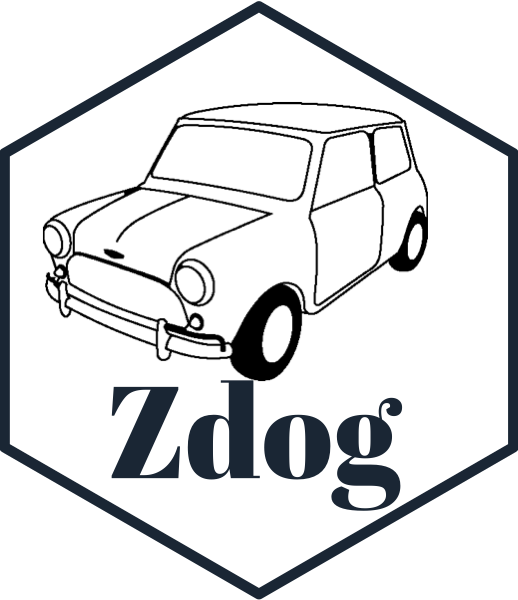
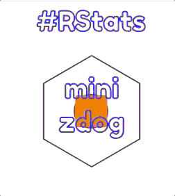

<!-- README.md is generated from README.Rmd. Please edit that file -->

```{r, include = FALSE}
knitr::opts_chunk$set(
  collapse = TRUE,
  comment = "#>",
  fig.path = "man/figures/README-",
  out.width = "100%"
)


library(minizdog)
```


```{r echo = FALSE, eval = FALSE}
# Quick logo generation. Borrowed heavily from Nick Tierney's Syn logo process
library(magick)
library(showtext)
font_add_google("Abril Fatface", "gf")


# pkgdown::build_site(override = list(destination = "../coolbutuseless.github.io/package/minizdog"))
```


```{r echo = FALSE, eval = FALSE}
img <- image_read("man/figures/mini-cooper-s.gif") %>%
  image_transparent(color = "#f9fafb", fuzz = 10) %>%
  image_trim() %>%
  image_threshold()


hexSticker::sticker(subplot  = img,
                    s_x      = 0.92,
                    s_y      = 1.2,
                    s_width  = 1.5,
                    s_height = 0.95,
                    package  = "Zdog",
                    p_x      = 0.98,
                    p_y      = 0.55,
                    p_color  = "#223344",
                    p_family = "gf",
                    p_size   = 11,
                    h_size   = 1.2,
                    h_fill   = "#ffffff",
                    h_color  = "#223344",
                    filename = "man/figures/logo.png")

image_read("man/figures/logo.png")
```


# minizdog   

<!-- badges: start -->


<!-- badges: end -->

`minizdog` is a package for building [Zdog](https://zzz.dog) illustrations in R.

This package was inspired by [OganM](https://twitter.com/OganM)'s package called [rdog](https://github.com/oganm/rdog).  That package is much more feature complete, 
with better documentation and examples and other stuff.


This package is part of an ongoing exploration of writing document interfaces with 
R and [R6](https://cran.r-project.org/package=R6) - every drawing feature is 
mapped to an R6 object, and these objects are nested within each other to create 
the document.


## Installation

You can install the development version from [GitHub](https://github.com/coolbutuseless/minizdog) with:

``` r
# install.packages("devtools")
devtools::install_github("coolbutuseless/minizdog")
```

## All-in-one example


```{r}
#~~~~~~~~~~~~~~~~~~~~~~~~~~~~~~~~~~~~~~~~~~~~~~~~~~~~~~~~~~~~~~~~~~~~~~~~~~~~~
# Initialize a document
#~~~~~~~~~~~~~~~~~~~~~~~~~~~~~~~~~~~~~~~~~~~~~~~~~~~~~~~~~~~~~~~~~~~~~~~~~~~~~
zdog <- ZdogIllustration$new(zoom = 2, yincrement = 0.03)

#~~~~~~~~~~~~~~~~~~~~~~~~~~~~~~~~~~~~~~~~~~~~~~~~~~~~~~~~~~~~~~~~~~~~~~~~~~~~~
# Create a circle as a separate object
#~~~~~~~~~~~~~~~~~~~~~~~~~~~~~~~~~~~~~~~~~~~~~~~~~~~~~~~~~~~~~~~~~~~~~~~~~~~~~
ell <- minizdog::ZdogEllipse$new(diameter = 20, stroke = 5, color = '#636')$
  translate(z = -20)

#~~~~~~~~~~~~~~~~~~~~~~~~~~~~~~~~~~~~~~~~~~~~~~~~~~~~~~~~~~~~~~~~~~~~~~~~~~~~~
# Create a rectangle directly as a child of the illustration
#~~~~~~~~~~~~~~~~~~~~~~~~~~~~~~~~~~~~~~~~~~~~~~~~~~~~~~~~~~~~~~~~~~~~~~~~~~~~~
zdog$rect(width = 20, height = 20, stroke = 3)$
  update(fill = TRUE, color = '#e62')$
  translate(z = -10)

#~~~~~~~~~~~~~~~~~~~~~~~~~~~~~~~~~~~~~~~~~~~~~~~~~~~~~~~~~~~~~~~~~~~~~~~~~~~~~
# Create a polygon using the `ztag` helper
#~~~~~~~~~~~~~~~~~~~~~~~~~~~~~~~~~~~~~~~~~~~~~~~~~~~~~~~~~~~~~~~~~~~~~~~~~~~~~
poly <- ztag$polygon(radius = 40, sides = 6)

#~~~~~~~~~~~~~~~~~~~~~~~~~~~~~~~~~~~~~~~~~~~~~~~~~~~~~~~~~~~~~~~~~~~~~~~~~~~~~
# create some text
#~~~~~~~~~~~~~~~~~~~~~~~~~~~~~~~~~~~~~~~~~~~~~~~~~~~~~~~~~~~~~~~~~~~~~~~~~~~~~
text <- ZdogText$new(value = "#RStats\\n\\nmini\\nzdog")$
  update(color = '#00f', textAlign = 'center', fontSize = 20)$
  translate(y = 15)

#~~~~~~~~~~~~~~~~~~~~~~~~~~~~~~~~~~~~~~~~~~~~~~~~~~~~~~~~~~~~~~~~~~~~~~~~~~~~~
# Append the standalone elements to the main document
#~~~~~~~~~~~~~~~~~~~~~~~~~~~~~~~~~~~~~~~~~~~~~~~~~~~~~~~~~~~~~~~~~~~~~~~~~~~~~
zdog$append(ell)
zdog$append(poly)
zdog$append(text)
```


```{r eval = FALSE}
#~~~~~~~~~~~~~~~~~~~~~~~~~~~~~~~~~~~~~~~~~~~~~~~~~~~~~~~~~~~~~~~~~~~~~~~~~~~~~
# If running in Rstudio this will open the zdog illustration in the viewer pane.
# Github limits what a README can show, so this is just a GIF animation of
# what the above javascript creates
#~~~~~~~~~~~~~~~~~~~~~~~~~~~~~~~~~~~~~~~~~~~~~~~~~~~~~~~~~~~~~~~~~~~~~~~~~~~~~
zdog$show()
```





```{r eval = FALSE}
as.character(zdog) # will print just the javascript code
zdog$as_html()     # wraps the javascript in some html boilerplate
```


<details close>
<summary> <span title='as.character(zdog) output (JS)'> as.character(zdog) output (JS)</span> </summary>
```{r echo = FALSE, comment = ''}
cat(as.character(zdog))
```
</details><br />


<details open>
<summary> <span title='zdog$as_html() output'> zdog$as.html() output </span> </summary>
```{r echo = FALSE, comment = ''}
print(zdog$as_html())
```
</details><br />


